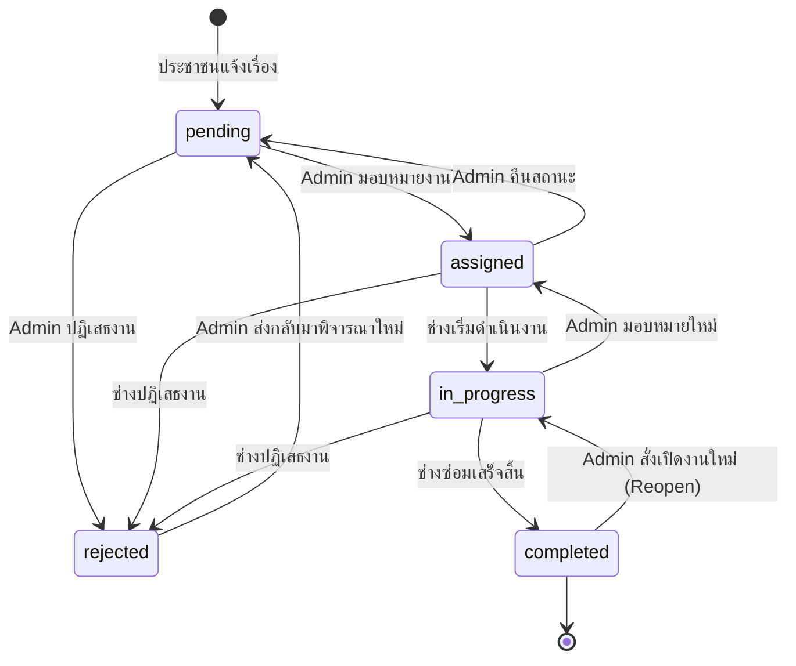

# ResolveNow — System Context for AI Assistants
> อัปเดตล่าสุด: 2026-09-11 | Version: V17.0 (Dedicated Multi-Portal Architecture: /admin, /tech, /, /ceo)

## ภาพรวม (Overview)
ระบบเว็บแอปพลิเคชันรับแจ้งและติดตามเรื่องร้องเรียนของเทศบาล/เมืองอัจฉริยะ (Smart City) แยกตามพอร์ทัลการใช้งานอย่างเด็ดขาด:
- **Dedicated Portals (แยกการเข้าใช้งานตาม URL)**:
  - `http://.../` (Citizen Portal): สำหรับประชาชน แจ้งเรื่อง 5 ขั้นตอน ติดตามสถานะ แผนที่ความร้อน แชทกับเทศบาล และ LINE Login
  - `http://.../admin` (Admin Portal): สำหรับผู้ดูแลระบบ หน้าล็อกอินเฉพาะแอดมิน เข้าสู่ศูนย์บริหารจัดการตั๋ว คิวงาน มอบหมาย จัดการช่างและหมวดหมู่ กล่องข้อความ และรายงาน
  - `http://.../tech` หรือ `/technician` (Technician Portal): สำหรับช่าง/เจ้าหน้าที่ หน้าล็อกอินเฉพาะช่าง เข้าสู่หน้าปฏิบัติการของช่างแต่ละคน รับงาน ดำเนินการ อัปโหลดรูป Before/After ปิดงาน และขอความช่วยเหลือ
  - `http://.../ceo` (CEO Dashboard): แดชบอร์ดสรุปสถิติภาพรวมและการปฏิบัติตาม SLA สำหรับผู้บริหาร (Read-only, ไม่ต้อง Login, Masked PII)
- **Production URL**: https://resolvenow-hlv5.onrender.com
- **GitHub Repository**: https://github.com/TengFk7/resolvenow

---

## Tech Stack
| เลเยอร์ | เทคโนโลยี | รายละเอียด |
|---|---|---|
| **Runtime & Backend** | Node.js (v18+) + Express 4 | RESTful API, Single-Page App server |
| **Database** | MongoDB Atlas + Mongoose 9 | Cloud Database, Schema validation, Compound Indexes |
| **Session Store** | express-session + connect-mongo v6 | เซสชันเก็บใน MongoDB (`ttl: 7 days`, `touchAfter: 24h`, shared with Socket.IO) |
| **Authentication** | bcryptjs + OTP Email + LINE Login | เข้ารหัสรหัสผ่าน 10 rounds, รหัส OTP 6 หลักอายุ 5 นาที, OAuth2 |
| **Email Service** | Dual Provider: Nodemailer (Gmail) + SendGrid | ส่งรหัส OTP และระบบแจ้งเตือนทางอีเมล |
| **Cloud Storage** | Cloudinary (v2) + Custom Multer Engine | อัปโหลดรูปภาพ ปรับขนาดอัตโนมัติ (max 1280px, auto quality), Fallback: `/public/uploads/` |
| **LINE Integration** | LINE Messaging API + LINE Login + LINE LIFF | Push Notifications (Flex Messages), LINE Login OAuth2, LIFF 2.x สำหรับรีวิว |
| **Real-time** | Socket.IO v4 | Two-way events, DM Rooms, Ticket Status update, Comments, Heartbeat ping-pong |
| **AI Integration** | Anthropic Claude (`/api/ai`) + Google Gemini | วิเคราะห์ความเร่งด่วนและจัดประเภทปัญหาอัตโนมัติ |
| **Frontend** | Vanilla HTML5 / CSS3 / JavaScript (ES6+) | SPA ไร้ Framework, Glassmorphism, 3D CSS Transitions, Responsive Mobile-First |
| **Mapping & GIS** | Leaflet.js + OpenStreetMap | Reverse Geocoding (Nominatim), แผนที่พิกัด, Heatmap แสดงความหนาแน่นของปัญหา |
| **SLA Engine** | `utils/slaHelper.js` + Background Cron | คำนวณ Deadline อัตโนมัติตาม Urgency, ตรวจสอบและบันทึก SLA Breach ทุก 5 นาที |

---

## โครงสร้างไฟล์โปรเจกต์ (Project Structure)
```
ResolveNow/
├── server.js                  ← Entry point (DNS override → DB → Session → Socket.IO engine → Routes)
├── package.json               ← Dependencies & Scripts
├── .env / .env.example        ← ตัวแปรสภาพแวดล้อม (Environment Variables)
├── validateFlex.js            ← Script ตรวจสอบความถูกต้องของ LINE Flex Message JSON
├── INSTALL.txt                ← คู่มือการติดตั้งและตั้งค่าระบบ
├── SYSTEM_CONTEXT.md          ← เอกสารนี้: สถาปัตยกรรมและบริบทระบบสำหรับ AI Assistant
├── README.md                  ← คู่มือภาพรวมโปรเจกต์
├── data_dictionary.html       ← พจนานุกรมข้อมูลฉบับสมบูรณ์ (7 Collections, 80+ Fields)
│
├── config/
│   ├── db.js                  ← Mongoose connection (บังคับ IPv4 family:4, Google DNS resolver)
│   ├── seed.js                ← Auto-seed: admin, ช่าง 7 หมวด (tech1-7), ประชาชนทดสอบ + 7 หมวดเริ่มต้น
│   ├── cloudinary.js          ← Custom CloudinaryEngine (Multer Storage), fallback local disk
│   ├── mailer.js              ← Nodemailer Gmail + SendGrid dual sender
│   ├── lineNotify.js          ← LINE Messaging API Flex Message Push (Admin, Tech, Citizen, Followers)
│   └── slaJob.js              ← Cron ทุก 5 นาทีตรวจ SLA Breach + Cron ทุก 1 ชั่วโมงล้าง Chat ที่หมดอายุ
│
├── models/
│   ├── User.js                ← Schema ผู้ใช้: บทบาท citizen|technician|admin, specialty, LINE profile
│   ├── Ticket.js              ← Schema เรื่องร้องเรียน: TKT-00001, SLA, Status, รูปภาพ, โหวต, ผู้ติดตาม, Indexes
│   ├── HelpRequest.js         ← Schema ขอความช่วยเหลือข้ามแผนก: HELP-001, requester, targetDept
│   ├── Category.js            ← Schema หมวดหมู่ปัญหา: name (unique), label, icon, technicianIds, isDefault
│   ├── Comment.js             ← Schema ข้อความสนทนาในแต่ละตั๋ว (Ticket Chat, max 500 chars)
│   ├── DirectMessage.js       ← Schema แชทตรง Citizen ↔ Admin (1 citizen = 1 thread, max 500 chars)
│   └── Counter.js             ← Auto-increment sequence counter ('ticket', 'help')
│
├── routes/
│   ├── auth.js                ← /api/auth (Login, Logout, OTP, Register, Change PW, LINE link/register)
│   ├── tickets.js             ← /api/tickets (CRUD, Assign, Status, Upload, Rating, Search, Comments, Reports)
│   ├── technicians.js         ← /api/technicians (รายชื่อช่าง, ภาระงานปัจจุบัน, capacity)
│   ├── helpRequests.js        ← /api/help-requests (CRUD ขอความช่วยเหลือ, Accept, Cancel)
│   ├── ai.js                  ← /api/ai (Anthropic Claude Urgency Analyzer)
│   ├── categories.js          ← /api/categories (CRUD หมวดหมู่, ผูกช่าง, ถ่ายโอนตั๋วเมื่อลบ)
│   ├── track.js               ← /api/track (Public ticket tracker ไม่ต้องยืนยันตัวตน, Masked PII)
│   ├── ceo.js                 ← /api/ceo (Read-only Dashboard endpoints สำหรับผู้บริหาร)
│   ├── directMessages.js      ← /api/direct-messages (Direct Message API ระหว่าง Citizen กับ Admin)
│   └── lineAuth.js            ← /auth/line (LINE Login OAuth2 callback flow พร้อม crypto state)
│
├── utils/
│   └── slaHelper.js           ← [NEW] รวมศูนย์คำนวณ SLA Deadlines และตรวจ Breach (SLA_RULES)
│
├── data/
│   └── store.js               ← In-memory Map (otpStore), STATUSES enum array
│
├── docs/                      ← เอกสารสถาปัตยกรรมและแบบจำลองระบบ
│   ├── context_diagram.md     ← System Context Diagram (Mermaid)
│   ├── data_dictionary.md     ← Data Dictionary Markdown (7 Collections)
│   ├── dfd.md                 ← Data Flow Diagram Level 0 & Level 1 (Mermaid)
│   ├── er_diagram.md          ← Entity-Relationship Diagram (Mermaid)
│   ├── context_diagram.html   ← Context Diagram HTML viewer
│   ├── DFD.html               ← DFD HTML viewer
│   ├── er_diagram.html        ← ER Diagram HTML viewer
│   └── ER BY Claud.html       ← ER Model Viewer
│
├── scripts/
│   └── seedMockTickets.js     ← Script สร้าง Mock Data สำหรับทดสอบและสาธิต
│
└── public/
    ├── index.html             ← SPA HTML หลัก (~88KB) โครงสร้างหน้าต่าง โมดอล และคอมโพเนนต์
    ├── track.html             ← หน้าเว็บค้นหาและติดตามสถานะตั๋วแบบสาธารณะ (Standalone)
    ├── liff-rating.html       ← หน้าประเมินความพึงพอใจผ่าน LINE In-App Browser (LIFF 2.x)
    ├── css/
    │   ├── style.css          ← สไตล์ชีตหลัก (~104KB) การจัดหน้า, ธีมสี, คอมโพเนนต์
    │   └── animations.css     ← คลาสแอนิเมชัน (Page enter, Glassmorphism, 3D Flip)
    ├── js/
    │   ├── app.js             ← Global State, การตรวจสอบเซสชัน (`enterApp`), Socket connection
    │   ├── ui.js              ← ฟังก์ชันตัวช่วย UI, Toast, หมวดหมู่ไดนามิก, สถิติ, Leaflet Heatmap
    │   ├── auth.js            ← จัดการ Login, Register, OTP verification, 3D Flip, LINE Auth
    │   ├── citizen.js         ← Dashboard ประชาชน, ฟอร์มส่งเรื่อง, พิกัด GPS, การให้คะแนน
    │   ├── technician.js      ← Dashboard ช่าง, อัปโหลดรูปภาพก่อน/หลังซ่อม, งานฉุกเฉิน
    │   ├── admin.js           ← Dashboard แอดมิน, กราฟ Donut, คิวมอบหมายงาน, จัดการหมวดหมู่
    │   └── directChat.js      ← หน้าต่างและ Logic การแชทตรง Citizen ↔ Admin แบบเรียลไทม์
    └── uploads/               ← โฟลเดอร์สำรองสำหรับรูปภาพในเครื่อง (Local Fallback)
```

---

## สกีมาฐานข้อมูล (Database Schemas & Models)

### 1. User (`models/User.js`)
```js
{
  firstName:       { type: String, required: true },
  lastName:        { type: String, required: true },
  email:           { type: String, required: true, unique: true, lowercase: true },
  password:        { type: String, required: true }, // bcrypt hash (10 rounds)
  role:            { type: String, enum: ['citizen', 'technician', 'admin'], default: 'citizen' },
  specialty:       { type: String, default: null },   // สำหรับช่าง (ตรงกับ Category.name เช่น Road, Water)
  lineUserId:      { type: String, default: null },   // Unique LINE User ID
  lineDisplayName: { type: String, default: null },   // ชื่อที่แสดงบน LINE
  avatar:          { type: String, default: null },   // URL รูปโปรไฟล์
  createdViaLine:  { type: Boolean, default: false }, // สร้างบัญชีผ่าน flow LINE Register หรือไม่
  createdAt, updatedAt
}
```

### 2. Ticket (`models/Ticket.js`)
```js
{
  ticketId:            { type: String, unique: true }, // e.g. "TKT-00001" (รันอัตโนมัติจาก Counter)
  citizenId:           { type: Schema.Types.ObjectId, ref: 'User', required: true },
  citizenName:         { type: String, required: true },
  citizenLineId:       { type: String, default: null },
  category:            { type: String, required: true }, // e.g. "Road", "Water"
  description:         { type: String, required: true }, // XSS sanitized
  location:            { type: String, required: true }, // ชื่อสถานที่จาก Reverse Geocoding
  lat:                 { type: Number, required: true }, // ละติจูด
  lng:                 { type: Number, required: true }, // ลองจิจูด
  urgency:             { type: String, enum: ['normal', 'medium', 'urgent'], default: 'normal' },
  priorityScore:       { type: Number, default: 30 },    // คำนวณจาก Urgency (30/60/90) + Keywords (+10)
  status:              { type: String, enum: ['pending', 'assigned', 'in_progress', 'completed', 'rejected'], default: 'pending' },
  assignedTo:          { type: Schema.Types.ObjectId, ref: 'User', default: null },
  assignedName:        { type: String, default: null },
  rejectReason:        { type: String, default: null },
  citizenImage:        { type: String, default: null }, // URL รูปแรกที่ประชาชนส่ง
  images:              [{ type: String }],              // URL รูปภาพทั้งหมด (สูงสุด 5 รูป)
  beforeImage:         { type: String, default: null }, // รูปก่อนซ่อม (ช่างอัปโหลด)
  afterImage:          { type: String, default: null }, // รูปหลังซ่อม (ช่างอัปโหลด)
  rating:              { type: Number, min: 1, max: 5, default: null },
  ratingReason:        { type: String, default: null }, // XSS sanitized (ถ้าให้คะแนนน้อย)
  ratedAt:             { type: String, default: null },
  slaAssignDeadline:   { type: Date, required: true },  // เส้นตายรับงาน (จาก SLA_RULES)
  slaCompleteDeadline: { type: Date, default: null },   // เส้นตายทำงานเสร็จ (จาก SLA_RULES)
  slaBreached:         { type: Boolean, default: false },
  upvotes:             [{ userId: { type: Schema.Types.ObjectId, ref: 'User' }, createdAt: Date }],
  upvoteCount:         { type: Number, default: 0 },
  followers:           [{ userId: { type: Schema.Types.ObjectId, ref: 'User' }, lineUserId: String }],
  followerCount:       { type: Number, default: 0 },
  chatExpiresAt:       { type: Date, default: null },   // ปิดห้องสนทนาหลัง completed 24 ชม.
  createdAt, updatedAt
}

// ── Database Indexes ──
ticketSchema.index({ citizenId: 1, createdAt: -1 });        // ค้นหาตั๋วของประชาชน
ticketSchema.index({ assignedTo: 1, status: 1 });           // ค้นหาตั๋วตามช่างและสถานะ
ticketSchema.index({ category: 1, status: 1 });             // กรองตั๋วตามหมวดหมู่และสถานะ
ticketSchema.index({ status: 1, createdAt: -1 });           // คิวงาน Admin และ CEO Dashboard
ticketSchema.index({ slaBreached: 1, status: 1 });          // คิวงานตรวจสอบ SLA Breach (slaJob)
ticketSchema.index({ chatExpiresAt: 1 }, { sparse: true }); // กวาดล้าง Comment ที่หมดอายุ (slaJob)
```

### 3. Category (`models/Category.js`)
```js
{
  name:          { type: String, required: true, unique: true }, // e.g. "Road", "Water" (Key)
  label:         { type: String, required: true },               // e.g. "ถนน/ทางเท้า" (ภาษาไทย)
  icon:          { type: String, required: true },               // e.g. "🚧", "💧" (Emoji)
  technicianIds: [{ type: Schema.Types.ObjectId, ref: 'User' }], // ช่างที่สังกัดหมวดหมู่นี้
  isDefault:     { type: Boolean, default: false },              // 7 หมวดเริ่มต้นจะถูกตั้งเป็น true (ห้ามลบ)
  createdAt, updatedAt
}
```

### 4. DirectMessage (`models/DirectMessage.js`)
```js
{
  senderId:   { type: Schema.Types.ObjectId, ref: 'User', required: true },
  senderName: { type: String, required: true },
  senderRole: { type: String, enum: ['citizen', 'admin'], required: true },
  citizenId:  { type: Schema.Types.ObjectId, ref: 'User', required: true }, // Identifier ประจำ Thread
  message:    { type: String, required: true, maxlength: 500 },             // XSS Sanitized
  isRead:     { type: Boolean, default: false },                            // สถานะการเปิดอ่าน
  createdAt, updatedAt
}

// ── Compound Index ──
directMessageSchema.index({ citizenId: 1, createdAt: 1 }); // โหลดแชทตาม Thread เรียงตามเวลา
```

### 5. Comment (`models/Comment.js`)
```js
{
  ticketId:  { type: String, required: true }, // e.g. "TKT-00001"
  userId:    { type: Schema.Types.ObjectId, ref: 'User', required: true },
  userName:  { type: String, required: true },
  userRole:  { type: String, required: true },
  message:   { type: String, required: true, maxlength: 500 },
  createdAt, updatedAt
}
// Comment ในตั๋วจะถูกลบอัตโนมัติเมื่อ ticket.chatExpiresAt ถึงกำหนด (24 ชั่วโมงหลัง ticket completed)
```

### 6. HelpRequest (`models/HelpRequest.js`)
```js
{
  helpId:         { type: String, unique: true }, // e.g. "HELP-001"
  citizenId:      { type: Schema.Types.ObjectId, ref: 'User' },
  citizenName:    { type: String },
  message:        { type: String, required: true },
  status:         { type: String, enum: ['open', 'resolved', 'accepted', 'cancelled'], default: 'open' },
  ticketId:       { type: String, required: true },
  ticketCategory: { type: String },
  ticketLocation: { type: String },
  ticketDesc:     { type: String },
  requesterId:    { type: Schema.Types.ObjectId, ref: 'User', required: true },
  requesterName:  { type: String, required: true },
  requesterDept:  { type: String, required: true },
  targetDept:     { type: String, required: true },
  acceptedById:   { type: Schema.Types.ObjectId, ref: 'User', default: null },
  acceptedByName: { type: String, default: null },
  createdAt, updatedAt
}
```

### 7. Counter (`models/Counter.js`)
```js
{
  name: { type: String, required: true, unique: true }, // 'ticket' หรือ 'help'
  seq:  { type: Number, default: 0 }
}
// ใช้งานผ่าน Counter.nextSeq('ticket') คืนค่าตัวเลขลำดับถัดไปแบบ Atomic
```

---

## กฎและระบบคำนวณ SLA (SLA Engine — `utils/slaHelper.js`)

ระบบรวมศูนย์กฎ SLA ไว้ที่ `utils/slaHelper.js` เพื่อให้ทุกโมดูล (ตั๋วใหม่, แก้ไขสถานะ, มอบหมายงาน, Dashboard CEO และ Cron Job) ใช้มาตรฐานเดียวกัน:

```javascript
const SLA_RULES = {
  urgent:  { assignHours: 2,  completeHours: 8  },
  medium:  { assignHours: 8,  completeHours: 48 },
  normal:  { assignHours: 24, completeHours: 72 }
};
```

- **`calcSlaDeadlines(urgency)`**: คำนวณ `slaAssignDeadline` และ `slaCompleteDeadline` ณ เวลาที่สร้างตั๋ว
- **`checkIsSlaBreached(ticket)`**:
  - ตั๋วที่เสร็จ (`completed`) หรือถูกปฏิเสธ (`rejected`) จะยึดค่า `ticket.slaBreached` เดิม
  - ตั๋วสถานะ `pending`: ผิดสัญญาเมื่อ `now > ticket.slaAssignDeadline`
  - ตั๋วสถานะ `assigned` หรือ `in_progress`: ผิดสัญญาเมื่อ `now > ticket.slaCompleteDeadline`
- **Background SLA Checker (`config/slaJob.js`)**:
  - ทำงานอัตโนมัติทุก 5 นาที กวาดตั๋วที่เกินเวลาด้วย MongoDB `$or` query ที่สอดคล้องกับ Index `{ slaBreached: 1, status: 1 }`
  - อัปเดต `slaBreached = true` แบบ Batch อัตโนมัติ

---

## รายละเอียด REST API Endpoints

### 1. การยืนยันตัวตน (`/api/auth`)
| Method | เส้นทาง (Path) | สิทธิ์เข้าถึง | คำอธิบาย |
|---|---|---|---|
| `POST` | `/send-otp` | สาธารณะ | ตรวจสอบอีเมล, สร้าง OTP 6 หลัก บันทึกลงหน่วยความจำ (5 นาที), ส่งเมล |
| `POST` | `/register` | สาธารณะ | ตรวจสอบ OTP และสร้างบัญชีผู้ใช้บทบาท `citizen` |
| `POST` | `/login` | สาธารณะ | ตรวจสอบ Email และรหัสผ่าน bcrypt → สร้าง Express Session |
| `POST` | `/logout` | Authenticated | ทำลาย Session ใน MongoDB และล้าง Cookie |
| `GET` | `/me` | สาธารณะ | ตรวจสอบสถานะ Session ปัจจุบัน (คืนค่า `{ loggedIn: true, user }` หรือ `{ loggedIn: false }`) |
| `POST` | `/change-password` | Authenticated | เปลี่ยนรหัสผ่านใหม่ (ต้องระบุรหัสผ่านเดิม และมี Type/Length validation) |
| `GET` | `/line-pending` | สาธารณะ | ดึงข้อมูล LINE Profile ชั่วคราวที่รอการผูกบัญชี |
| `POST` | `/link-line` | สาธารณะ | เชื่อมต่อบัญชีเดิมเข้ากับ LINE Profile |
| `POST` | `/link-line-skip` | สาธารณะ | ข้ามการใส่รหัสผ่าน สร้างบัญชีใหม่โดยใช้ LINE Profile โดยตรง |
| `POST` | `/register-line` | สาธารณะ | ส่ง OTP ไปยังอีเมลเพื่อเปิดบัญชีใหม่พร้อมผูก LINE |
| `POST` | `/verify-line-otp` | สาธารณะ | ยืนยัน OTP และสร้างบัญชีพร้อมผูก LINE Profile |
| `POST` | `/admin-unlink-line` | Admin | ลบความเชื่อมโยง LINE ของผู้ใช้ออก |
| `GET` | `/admin-linked-lines` | Admin | รายชื่อผู้ใช้ทั้งหมดที่มีการผูกบัญชี LINE |
| `POST` | `/admin-unlink-all` | Admin | ยกเลิกการผูกบัญชี LINE ของผู้ใช้ทั้งหมด |

### 2. จัดการเรื่องร้องเรียน (`/api/tickets`)
| Method | เส้นทาง (Path) | สิทธิ์เข้าถึง | คำอธิบาย |
|---|---|---|---|
| `GET` | `/` | Authenticated | ดึงตั๋ว: citizen (เฉพาะของตน), tech (ตามสังกัดหรือที่ได้รับมอบหมาย), admin (ทั้งหมด) |
| `POST` | `/` | Authenticated | สร้างตั๋วใหม่ + อัปโหลดรูป (สูงสุด 5 รูป) + คำนวณ SLA Deadlines + แจ้งเตือน LINE |
| `PUT` | `/:id/status` | Authenticated | เปลี่ยนสถานะตาม State Transition Matrix (พร้อมตรวจ SLA Breach อัตโนมัติ) |
| `PUT` | `/:id/assign` | Admin | มอบหมายตั๋วให้ช่าง (`assignedTo`) พร้อมอัปเดตสถานะเป็น `assigned` |
| `POST` | `/:id/upload/before`| Technician | อัปโหลดภาพถ่ายก่อนเริ่มปฏิบัติงาน |
| `POST` | `/:id/upload/after` | Technician | อัปโหลดภาพถ่ายหลังปฏิบัติงานเสร็จสิ้น |
| `PUT` | `/:id/rating` | Citizen | ประเมินความพึงพอใจ (1-5 ดาว) พร้อมเหตุผล (XSS sanitized) |
| `PUT` | `/:id/rating/liff` | สาธารณะ (LIFF) | รับคะแนนประเมินผ่าน LINE LIFF โดยใช้ `citizenLineId` ตรวจสอบ |
| `GET` | `/public/:id/rating-status` | สาธารณะ | ตรวจสอบว่าตั๋วนี้ได้รับการประเมินแล้วหรือไม่ |
| `GET` | `/search` | สาธารณะ / Auth | ค้นหาตั๋วตามคำค้นหา สถานะ และหมวดหมู่ (หากไม่ได้ล็อกอินจะ Mask ข้อมูล PII) |
| `GET` | `/public-map` | สาธารณะ | ข้อมูลพิกัดและหมวดหมู่สำหรับแผนที่ Heatmap สาธารณะ (ย้อนหลัง 30 วัน) |
| `GET` | `/report` | Admin | ข้อมูลสถิติเชิงลึกสำหรับจัดทำรายงานสรุปประจำเดือน |
| `GET` | `/report/excel` | Admin | ส่งออกข้อมูลตั๋วเป็นไฟล์ `.xlsx` (Excel) |
| `GET` | `/export` | Admin | ส่งออกข้อมูลตั๋วเป็นไฟล์ `.csv` |
| `POST` | `/:id/upvote` | Authenticated | กดโหวต / ยกเลิกโหวตปัญหา (Toggle Atomic) มีผลต่อคะแนนความเร่งด่วน |
| `POST` | `/:id/follow` | Authenticated | กดติดตาม / ยกเลิกติดตาม เพื่อรับการแจ้งเตือนความคืบหน้าทาง LINE |
| `GET` | `/:id/comments` | Authenticated | ดึงข้อความสนทนาในตั๋ว (มี IDOR Protection: เฉพาะเจ้าของตั๋ว, ช่างที่รับงาน, หรือ Admin) |
| `POST` | `/:id/comments` | Authenticated | ส่งข้อความสนทนาในตั๋ว + ส่งแจ้งเตือนผ่าน Socket.IO |
| `DELETE`| `/:id` | Admin | ลบตั๋ว 1 ใบ + ลบรูปภาพออกจาก Cloudinary แบบ Cascade |
| `DELETE`| `/` | Admin | ล้างข้อมูลตั๋วทั้งหมด (ต้องระบุรหัสผ่าน `ADMIN_DELETE_PASSWORD` จาก Environment) |

### 3. ผู้บริหาร / CEO Dashboard (`/api/ceo`)
| Method | เส้นทาง (Path) | สิทธิ์เข้าถึง | คำอธิบาย |
|---|---|---|---|
| `GET` | `/tickets` | สาธารณะ (Read-only)| ดึงข้อมูลตั๋วทั้งหมดเพื่อแสดงบน Dashboard ผู้บริหาร (ประเมิน SLA เรียลไทม์, ไม่มีข้อมูล PII ส่วนบุคคล) |
| `GET` | `/technicians` | สาธารณะ (Read-only)| รายชื่อช่างและภาระงานปัจจุบันเพื่อวิเคราะห์ Workload Capacity |
| `GET` | `/categories` | สาธารณะ (Read-only)| รายการหมวดหมู่ทั้งหมดสำหรับสรุปสัดส่วนปัญหา |

### 4. ข้อความตรง / Direct Messages (`/api/direct-messages`)
| Method | เส้นทาง (Path) | สิทธิ์เข้าถึง | คำอธิบาย |
|---|---|---|---|
| `GET` | `/` | Citizen | ประวัติข้อความแชทตรงของประชาชนผู้เรียก (สูงสุด 200 รายการ) พร้อมปรับสถานะเป็นอ่านแล้ว |
| `GET` | `/unread-count` | Citizen | จำนวนข้อความจาก Admin ที่ประชาชนยังไม่ได้เปิดอ่าน |
| `GET` | `/all` | Admin | รายชื่อบทสนทนาทั้งหมดแยกตามประชาชน พร้อมแสดงจำนวนข้อความที่ยังไม่อ่าน |
| `GET` | `/admin-unread` | Admin | ผลรวมข้อความที่ยังไม่อ่านทั้งหมดจากประชาชนทุกคน |
| `GET` | `/:citizenId` | Admin | ประวัติการสนทนาของประชาชนคนดังกล่าว พร้อมปรับสถานะเป็นอ่านแล้ว |
| `POST` | `/` | Authenticated | ส่งข้อความ DM (Citizen → Admin หรือ Admin → Citizen) + Push Socket event |

### 5. จัดการหมวดหมู่ (`/api/categories`)
| Method | เส้นทาง (Path) | สิทธิ์เข้าถึง | คำอธิบาย |
|---|---|---|---|
| `GET` | `/` | สาธารณะ | รายการหมวดหมู่ทั้งหมด พร้อมรายชื่อช่างที่สังกัด |
| `POST` | `/` | Admin | เพิ่มหมวดหมู่ใหม่ (Sanitize ชื่อ, Label, Icon ด้วย XSS) |
| `PUT` | `/:id` | Admin | แก้ไขชื่อและไอคอนของหมวดหมู่ |
| `PUT` | `/:id/technicians` | Admin | มอบหมายช่างเข้าสังกัดหมวดหมู่ |
| `DELETE`| `/:id` | Admin | ลบหมวดหมู่ (หากมีตั๋วค้าง จะย้ายตั๋วทั้งหมดไปยังหมวดหมู่ตั้งต้น เช่น `Road` ก่อนลบ) |

### 6. ขอความช่วยเหลือข้ามฝ่าย (`/api/help-requests`)
| Method | เส้นทาง (Path) | สิทธิ์เข้าถึง | คำอธิบาย |
|---|---|---|---|
| `GET` | `/` | Authenticated | ดึงรายการขอความช่วยเหลือ (Citizen เห็นเฉพาะของตนเอง, Tech และ Admin เห็นทั้งหมด) |
| `POST` | `/` | Technician | ส่งคำขอความช่วยเหลือไปยังแผนกช่างอื่น |
| `PUT` | `/:id/accept` | Technician | กดรับคำขอความช่วยเหลือเพื่อร่วมแก้ไขปัญหา |
| `PUT` | `/:id/cancel` | Technician | ยกเลิกคำขอความช่วยเหลือ (เฉพาะผู้สร้างคำขอ) |

---

## ความปลอดภัยและการป้องกันช่องโหว่ (Security Hardening)

1. **Session & Cookie Security**:
   - ตรวจสอบ `SESSION_SECRET` ในระดับ Production (`NODE_ENV === 'production'`) หากไม่ได้ตั้งค่าเซิร์ฟเวอร์จะปฏิเสธการเริ่มทำงานทันที (`process.exit(1)`)
   - คุกกี้ตั้งค่า `httpOnly: true`, `sameSite: 'lax'`, `secure: true` (บน Production)
   - ใช้ `touchAfter: 24 * 3600` ลดการเขียนฐานข้อมูล MongoDB โดยไม่จำเป็น
   - นำเซสชันมาใช้ร่วมกับ Socket.IO ผ่าน `io.engine.use(sessionMiddleware)`

2. **Socket.IO IDOR Protection (`server.js`)**:
   - ในการ Join ห้อง Direct Message (`dm_join`):
     - ตรวจสอบ `socket.request.session?.userId`
     - ป้องกันการส่ง ID ผู้อื่นมาสวมรอย หาก `data.userId !== sessionUserId` จะปฏิเสธและบันทึก Security Alert ทันที
     - ตรวจสอบสิทธิ์บทบาท (`role`) จากฐานข้อมูลจริงก่อนอนุญาตให้เข้าห้อง `admin_dm` หรือ `citizen_dm_<userId>`

3. **NoSQL Injection & Strict Type Validation**:
   - ใช้งาน `express-mongo-sanitize` คัดกรอง Request Body และ Params
   - เส้นทางค้นหา `/api/tickets/search` ตรวจสอบประเภทตัวแปร (`typeof q === 'string'`) ป้องกัน Query Selector Injection
   - เส้นทางเปลี่ยนรหัสผ่านและผูก LINE ตรวจสอบ `typeof` อย่างเคร่งครัด

4. **XSS Protection**:
   - ใช้ไลบรารี `xss` คลุมทุกจุดรับข้อความ: รายละเอียดตั๋ว, เหตุผลการประเมิน, หมวดหมู่, ข้อความแชท และชื่อ-นามสกุลผู้ใช้
   - ในฝั่ง Frontend (`ui.js`) ใช้งาน `escapeHTML()` ก่อนเรนเดอร์ลงใน innerHTML เสมอ

5. **Ticket Comments & HelpRequests IDOR Protection**:
   - `GET /api/tickets/:id/comments`: ประชาชนดูได้เฉพาะตั๋วที่ตนเองแจ้ง, ช่างดูได้เฉพาะตั๋วที่ตนได้รับมอบหมาย, แอดมินดูได้ทั้งหมด
   - `GET /api/help-requests`: กรองให้ประชาชนมองเห็นเฉพาะคำขอที่เกี่ยวกับตั๋วของตนเอง

6. **Privacy Protection on Public Search**:
   - การค้นหาตั๋วผ่าน `/api/tickets/search` สำหรับผู้ใช้ที่ไม่ได้ล็อกอิน จะทำการ Mask ข้อมูล `description` และ `location` ด้วยคำว่า `"ปกปิดข้อมูลเพื่อความเป็นส่วนตัว"` ป้องกันการเก็บเกี่ยวข้อมูลส่วนบุคคล

7. **Admin Delete Authorization**:
   - การลบตั๋วทั้งหมด (`DELETE /api/tickets`) บังคับตรวจสอบรหัสผ่านเทียบกับ `process.env.ADMIN_DELETE_PASSWORD` จาก Environment โดยตรง และตัดการ Fallback เป็นค่าเริ่มต้นออกทั้งหมดเพื่อความปลอดภัยสูงสุด

8. **CSRF State Security for LINE Login**:
   - สร้างพารามิเตอร์ State สำหรับ OAuth2 ด้วย `crypto.randomBytes(16).toString('hex')` แทนการสุ่มด้วย `Math.random()`

---

## วงจรสถานะของ Ticket (State Transition Matrix)



- **ช่าง (Technician)** สามารถเปลี่ยนสถานะได้เฉพาะตั๋วที่ตนเองได้รับมอบหมาย (`assignedTo == user._id`) เท่านั้น
- มีการตรวจสอบ SLA Breach ทุกครั้งที่มีการเปลี่ยนสถานะหรือมอบหมายงาน

---

## บัญชีทดสอบเริ่มต้น (Seeded Accounts)
ระบบจะทำการสร้างบัญชีเริ่มต้นให้อัตโนมัติเมื่อเริ่มรันครั้งแรก:

| บทบาท (Role) | อีเมล (Email) | รหัสผ่าน (Password) | ชื่อ-นามสกุล | สังกัด/ความเชี่ยวชาญ |
|---|---|---|---|---|
| **Admin** | `admin@resolvenow.th` | `admin1234` | Admin Dispatcher | ผู้ดูแลระบบส่วนกลาง |
| **Technician 1** | `tech1@resolvenow.th` | `tech1234` | วิชัย โยธา | ถนน/ทางเท้า (`Road`) |
| **Technician 2** | `tech2@resolvenow.th` | `tech1234` | มานะ ประปา | ท่อแตก/น้ำไม่ไหล (`Water`) |
| **Technician 3** | `tech3@resolvenow.th` | `tech1234` | สมชาย ไฟฟ้า | ไฟฟ้าสาธารณะดับ (`Electricity`) |
| **Technician 4** | `tech4@resolvenow.th` | `tech1234` | สุรัตน์ สุขา | ขยะตกค้าง (`Garbage`) |
| **Technician 5** | `tech5@resolvenow.th` | `tech1234` | บุญมี ปราบ | สัตว์มีพิษ/จรจัด (`Animal`) |
| **Technician 6** | `tech6@resolvenow.th` | `tech1234` | สมศรี ป่าไม้ | กิ่งไม้วางทาง (`Tree`) |
| **Technician 7** | `tech7@resolvenow.th` | `tech1234` | อนันต์ กู้ภัย | เพลิง/ภัยพิบัติ (`Hazard`) |
| **Citizen (Dev)**| `tenginpb@gmail.com` | `123456` | Teng Teng | ประชาชนทั่วไป |

---

## ตัวแปรสภาพแวดล้อมที่สำคัญ (Environment Variables)
```env
# Server
PORT=3001
BASE_URL=https://resolvenow-hlv5.onrender.com
NODE_ENV=development

# Database & Sessions
MONGODB_URI=mongodb+srv://<username>:<password>@cluster.mongodb.net/resolvenow
SESSION_SECRET=your-strong-random-session-secret

# Security
ADMIN_DELETE_PASSWORD=your-secure-admin-delete-password

# Email Services (OTP Delivery)
MAIL_USER=your-email@gmail.com
MAIL_PASS=your-gmail-app-password
SENDGRID_API_KEY=SG.your-sendgrid-api-key

# LINE Integration
LINE_CHANNEL_TOKEN=your-line-channel-access-token
LINE_ADMIN_USER_ID=your-line-admin-user-id
LINE_LOGIN_CLIENT_ID=your-line-login-channel-id
LINE_LOGIN_CLIENT_SECRET=your-line-login-channel-secret
LINE_LOGIN_CALLBACK_URL=https://resolvenow-hlv5.onrender.com/auth/line/callback
LINE_LIFF_ID=your-liff-id

# Cloudinary (Image Hosting)
CLOUDINARY_CLOUD_NAME=your-cloud-name
CLOUDINARY_API_KEY=your-api-key
CLOUDINARY_API_SECRET=your-api-secret

# AI Assistants
ANTHROPIC_API_KEY=sk-ant-api03-...
GEMINI_API_KEY=your-gemini-api-key
```

---

## คำสั่งการทำงาน (Run Commands)
```bash
# ติดตั้ง dependencies
npm install

# รันโหมด Development (nodemon รีโหลดอัตโนมัติ)
npm run dev

# รันโหมด Production
npm start

# URL สำหรับเข้าใช้งาน
http://localhost:3001            ← Single Page Application (ระบบหลัก)
http://localhost:3001/track      ← หน้าค้นหาและติดตามสถานะสำหรับประชาชนทั่วไป (Public Tracker)
http://localhost:3001/liff-rating← หน้าประเมินผลผ่าน LINE LIFF
http://localhost:3001/Datadic    ← พจนานุกรมข้อมูล (Data Dictionary Web View)
```

---

## ข้อพึงระวังและข้อควรจำสำหรับ AI (Critical Notes for AI Assistants)
1. **Default Port**: ในเวอร์ชันปัจจุบัน `server.js` กำหนดค่าเริ่มต้นคือพอร์ต `3001` (`process.env.PORT || 3001`)
2. **SLA Calculation**: ห้ามเขียนสูตรคำนวณวันเวลา SLA แยกย่อยใน Route ใหม่ ให้ใช้ฟังก์ชันจาก `utils/slaHelper.js` เท่านั้น (`calcSlaDeadlines` และ `checkIsSlaBreached`)
3. **Admin Password Check**: ฟังก์ชันลบตั๋วทั้งหมดในระบบบังคับใช้ `ADMIN_DELETE_PASSWORD` จาก env เท่านั้น ไม่มีค่า Default ใน Code อีกต่อไป
4. **Direct Message vs Ticket Comment**: 
   - `DirectMessage` เป็นการแชทตรงระหว่าง Citizen และ Admin (1 Citizen = 1 Thread) ผ่านเมนูแชทลอย (Cloud FAB)
   - `Comment` เป็นการแชทภายในตั๋วแต่ละใบ (`TKT-xxxxx`) มีอายุสิ้นสุด 24 ชม. หลังตั๋วปิดงาน
5. **Dynamic Categories**: หมวดหมู่โหลดแบบไดนามิกจากฐานข้อมูลผ่าน `/api/categories` โดยอ็อบเจกต์ `DEPT` และ `DEPT_ICON` ฝั่ง Frontend จะถูกสร้างขึ้นใหม่เมื่อเข้าสู่แอป (`enterApp()`)
6. **DNS Override**: ในสภาพแวดล้อม Node.js บางเครื่องที่มีปัญหา DNS resolve ของ MongoDB Atlas โค้ดใน `server.js` มีการบังคับใช้ Google DNS (`8.8.8.8`) และ IPv4 ก่อน require โมดูลอื่นๆ
