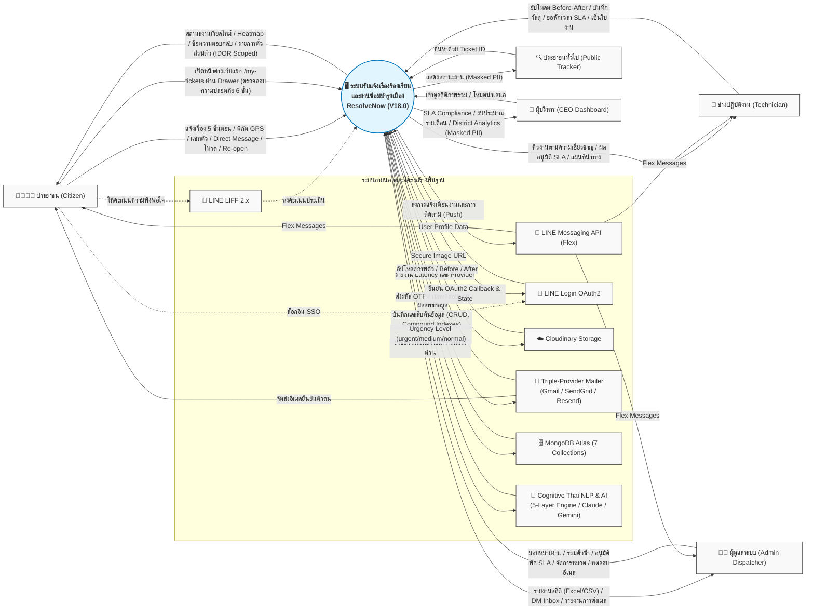

# ResolvNow Context Diagram (ภาพรวมระบบ)
> อัปเดตล่าสุด: 2026-09-18 | Version: V18.0

แผนภาพ Context Diagram นี้แสดงการโต้ตอบระหว่าง **ระบบ ResolveNow (V18.0)** กับ **ผู้ใช้งานทุกบทบาท (External Entities)** และ **ระบบภายนอกอื่นๆ**

---

## คำอธิบายสัญลักษณ์และปฏิสัมพันธ์

1. **ระบบหลัก (วงกลมตรงกลาง):** `ResolveNow (V18.0)` ทำหน้าที่เป็นศูนย์กลางการประมวลผล (Node.js/Express + Socket.IO + SLA Engine + Cognitive Thai NLP + Health Checks)
2. **ผู้ใช้งานระบบ (ฝั่งซ้าย):**
   - **ประชาชน (Citizen):** แจ้งเรื่องร้องเรียน 5 ขั้นตอนพร้อมพิกัด GPS, แนบรูปได้สูงสุด 5 รูป, สนทนาในตั๋ว, แชทตรงกับ Admin (DM), กดโหวต/ติดตามปัญหา, และยื่นเรื่องขอเปิดงานใหม่ (Re-open)
   - **ประชาชนทั่วไป (Public User):** ติดตามสถานะความคืบหน้าของตั๋วผ่านหน้าระบบค้นหาสาธารณะ (`/track`) โดยมีการปกปิดข้อมูลส่วนบุคคลตามหลัก PDPA
   - **ช่างปฏิบัติงาน (Technician):** ดำเนินการงานตามความเชี่ยวชาญ, อัปโหลดรูปภาพ Before & After, บันทึกรายการอะไหล่และค่าใช้จ่าย, ขอพักเวลา SLA ชั่วคราวเมื่อรออะไหล่, ขอความช่วยเหลือข้ามฝ่าย, และบันทึกลายเซ็นดิจิทัลในใบสั่งงาน
   - **ผู้ดูแลระบบ (Admin Dispatcher):** ควบคุมคิวงาน, มอบหมายงานตาม Workload Capacity, ตรวจจับและรวมตั๋วที่ซ้ำซ้อนในรัศมีใกล้เคียง, อนุมัติการพักเวลา SLA, จัดการหมวดหมู่ไดนามิก, ตอบข้อความ DM รวมศูนย์ และใช้เครื่องมือทดสอบการส่งอีเมล
   - **ผู้บริหารระดับสูง (CEO):** ดูสรุปตัวชี้วัด SLA Compliance, สรุปงบประมาณค่าซ่อมบำรุงประจำเดือน, และการวิเคราะห์เชิงพื้นที่และงบประมาณแยกตามเขต (District Analytics) ในโหมด Read-only
3. **ระบบภายนอกที่นำมาเชื่อมต่อ (ฝั่งขวา):**
   - **MongoDB Atlas:** ฐานข้อมูล NoSQL หลัก จัดเก็บ 7 Collections พร้อม Compound Indexes
   - **Cloudinary:** บริการจัดเก็บและปรับแต่งภาพถ่ายอัตโนมัติ (พร้อมระบบ Local Disk Fallback)
   - **Triple-Provider Mailer:** ระบบส่งอีเมลสำรอง 3 ชั้น (Gmail SMTP SSL/TLS, SendGrid API, Resend API)
   - **LINE Login / LIFF / Messaging API:** บริการ LINE สำหรับ Single Sign-On, Flex Messages แจ้งเตือนสถานะ และ LINE LIFF สำหรับการประเมินผล
   - **Cognitive Thai NLP & AI Service:** ระบบจำแนกความเร่งด่วน 5 ชั้น (Cognitive Heuristics 134 Cases) เสริมด้วย Anthropic Claude และ Google Gemini
