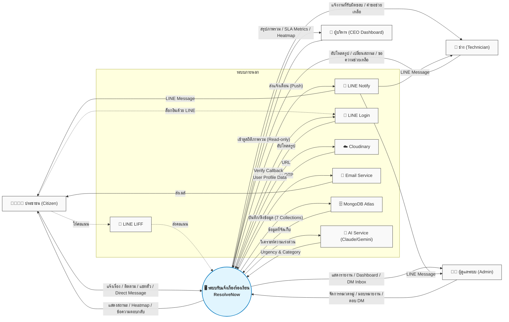

# ResolvNow Context Diagram (ภาพรวมระบบ)

แผนภาพ Context Diagram นี้แสดงการโต้ตอบระหว่าง **ระบบ ResolveNow** กับ **ผู้ใช้งาน (External Entities)** และ **ระบบภายนอกอื่นๆ**

## คำอธิบายสัญลักษณ์และปฏิสัมพันธ์
1. **ระบบหลัก (วงกลมตรงกลาง):** `ResolvNow` เป็นศูนย์กลางการประมวลผลข้อมูล (Node.js/Express + Socket.IO + SLA Engine)
2. **ผู้ใช้งานระบบ (ฝั่งซ้าย):**
   - **ประชาชน (Citizen):** ผู้แจ้งเรื่อง, ติดตามสถานะ, สนทนาในตั๋ว, แชทตรงกับ Admin (DM) และให้คะแนนประเมิน
   - **ช่าง (Technician):** ผู้รับผิดชอบงานซ่อมบำรุงในหมวดหมู่ที่ตนเองดูแล, ร้องขอความช่วยเหลือข้ามฝ่าย
   - **ผู้ดูแลระบบ (Admin):** ผู้ควบคุมระบบ, มอบหมายงาน, จัดการหมวดหมู่, ตอบแชท DM และดูสถิติเชิงลึก
   - **ผู้บริหาร (CEO):** ผู้เข้าดูข้อมูลสรุปภาพรวม สถิติ SLA และความพึงพอใจแบบ Read-only โดยไม่ต้องล็อกอิน
3. **ระบบภายนอกที่นำมาเชื่อมต่อ (ฝั่งขวา):**
   - **MongoDB Atlas:** ฐานข้อมูลหลักของระบบ (รองรับ 7 Collections)
   - **Cloudinary:** บริการฝากไฟล์รูปภาพทั้งหมด ปรับขนาดและบีบอัดอัตโนมัติ
   - **Email Service (Nodemailer / SendGrid):** สำหรับส่งรหัส OTP ทางอีเมล
   - **LINE Login / LIFF / Notify:** บริการของ LINE สำหรับ Social Login, ระบบประเมินความพึงพอใจ และการแจ้งเตือนแบบ Push Notifications
   - **AI Service (Anthropic Claude / Google Gemini):** ประเมินระดับความเร่งด่วนและจำแนกปัญหาอัตโนมัติ
