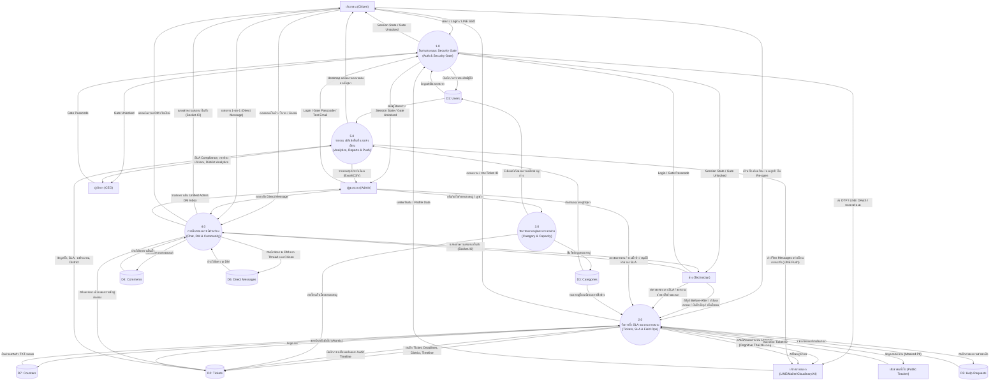

# Data Flow Diagram (DFD) - ResolvNow
> อัปเดตล่าสุด: 2026-09-18 | Version: V18.0

เอกสารนี้แสดงแผนภาพกระแสข้อมูล (Data Flow Diagram) ของระบบ ResolveNow (V18.0) ตั้งแต่ระดับภาพรวม (Level 0) จนถึงระดับกระบวนการย่อย (Level 1) รองรับ 7 Data Stores, ระบบรักษาความปลอดภัย Security Gate, การวิเคราะห์เชิงพื้นที่ (District Analytics), ระบบงบประมาณ/วัสดุ, และการส่งอีเมลแบบ Triple-Provider

---

## DFD Level 0 (Context Level DFD)
แผนภาพบริบทแสดงภาพรวมการไหลของข้อมูลระหว่างระบบ ResolveNow กับผู้ใช้งานและบริการภายนอก

```mermaid
graph TD
    %% Entities
    Citizen["ประชาชน (Citizen)"]
    PublicUser["ประชาชนทั่วไป (Public Tracker)"]
    Tech["ช่างปฏิบัติงาน (Technician)"]
    Admin["ผู้ดูแลระบบ (Admin)"]
    CEO["ผู้บริหาร (CEO Dashboard)"]
    ExtServices["บริการภายนอก\n(LINE / Triple Mailer / Cloudinary / AI)"]

    %% Process
    System(("ResolveNow (V18.0)\nระบบรับแจ้งเรื่องร้องเรียน\nและบริหารงานซ่อมบำรุง"))

    %% Data Flow Citizen
    Citizen -- ข้อมูลส่วนตัว / OTP / รหัสผ่าน / Security Gate --> System
    System -- สถานะเซสชัน / ข้อมูลผู้ใช้ --> Citizen
    
    Citizen -- ข้อมูลแจ้งเรื่อง / รูปภาพ / GPS / ยื่น Re-open --> System
    System -- รหัสติดตาม (Ticket ID) / สถานะงาน / Heatmap --> Citizen
    
    Citizen -- ข้อความแชทตั๋ว / Direct Message / โหวต / ติดตาม --> System
    System -- ข้อความสนทนา / แจ้งเตือนสถานะเรียลไทม์ --> Citizen

    %% Data Flow Public User
    PublicUser -- รหัส Ticket ID ที่ต้องการค้นหา --> System
    System -- ข้อมูลขั้นตอนการดำเนินงาน (Masked PII) --> PublicUser

    %% Data Flow Technician
    Tech -- ข้อมูลเข้าสู่ระบบ / Security Gate Passcode --> System
    System -- คิวงานที่ได้รับมอบหมายตามสังกัด --> Tech
    
    Tech -- รูปภาพ Before-After / สถานะงาน / บันทึกวัสดุ / เซ็นใบงาน --> System
    Tech -- ขอพักเวลา SLA / ขอความช่วยเหลือข้ามฝ่าย --> System
    System -- ผลการอนุมัติ SLA / งานที่ได้รับความช่วยเหลือ --> Tech

    %% Data Flow Admin
    Admin -- ข้อมูลเข้าสู่ระบบ / Gate Passcode --> System
    System -- Dashboard / คิวงาน / DM Inbox / แผนที่ความร้อน --> Admin
    
    Admin -- มอบหมายงาน / จัดการหมวด / รวมตั๋วซ้ำ / อนุมัติ SLA / ทดสอบเมล --> System
    System -- รายงานประจำเดือน (Excel/CSV) / ผลทดสอบอีเมล --> Admin

    %% Data Flow CEO
    CEO -- Gate Passcode / คำขอข้อมูลสถิติภาพรวม (Read-only) --> System
    System -- สถิติ SLA / งบประมาณรายเดือน / District Analytics (Masked PII) --> CEO

    %% Data Flow External Services
    System -- ส่ง OTP / ทดสอบเมล / อัปโหลดรูป / แจ้งเตือน LINE / วิเคราะห์ AI --> ExtServices
    ExtServices -- ผลการทำงาน / Callback Token / Image URL / Urgency Level --> System
```

---

## DFD Level 1
แผนภาพกระแสข้อมูลระดับที่ 1 แสดงกระบวนการหลัก 5 ด้านภายในระบบ ResolveNow และการเชื่อมโยงกับ 7 Data Stores

