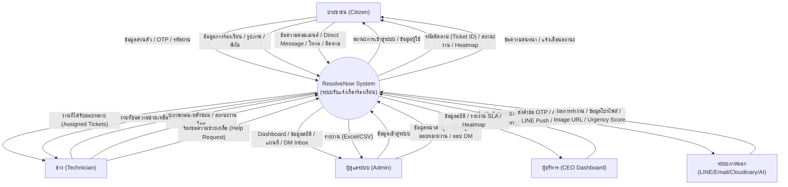
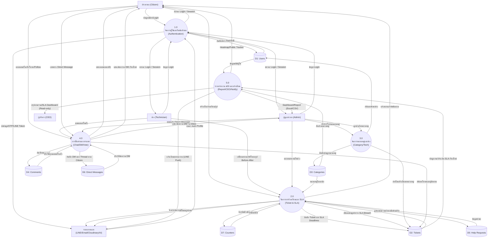

# Data Flow Diagram (DFD) - ResolvNow

เอกสารนี้แสดงแผนภาพกระแสข้อมูล (Data Flow Diagram) ของระบบ ResolvNow ตั้งแต่ระดับภาพรวม (Level 0) จนถึงระดับกระบวนการย่อย (Level 1) รองรับ 7 Data Stores

## DFD Level 0 (Context Diagram)
แผนภาพบริบท (Context Diagram) แสดงระบบในภาพรวมและการไหลของข้อมูลระหว่างระบบกับผู้ใช้งาน (External Entities)

## DFD Level 1
แผนภาพกระแสข้อมูลระดับที่ 1 แสดงกระบวนการหลักภายในระบบ ResolveNow และการเชื่อมต่อกับ 7 Data Stores

