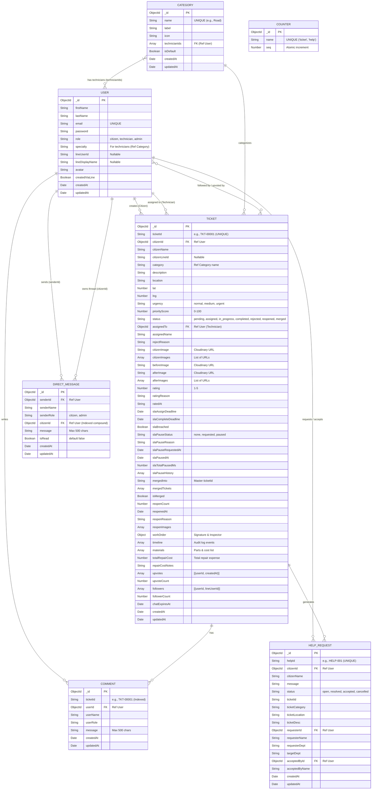

# Entity-Relationship (ER) Diagram - ResolvNow
> อัปเดตล่าสุด: 2026-09-15 | Version: V17.5

เอกสารนี้แสดงโครงสร้างและความสัมพันธ์ของฐานข้อมูล (MongoDB) ภายในระบบ ResolvNow (ครอบคลุมทั้ง 7 Collections)

