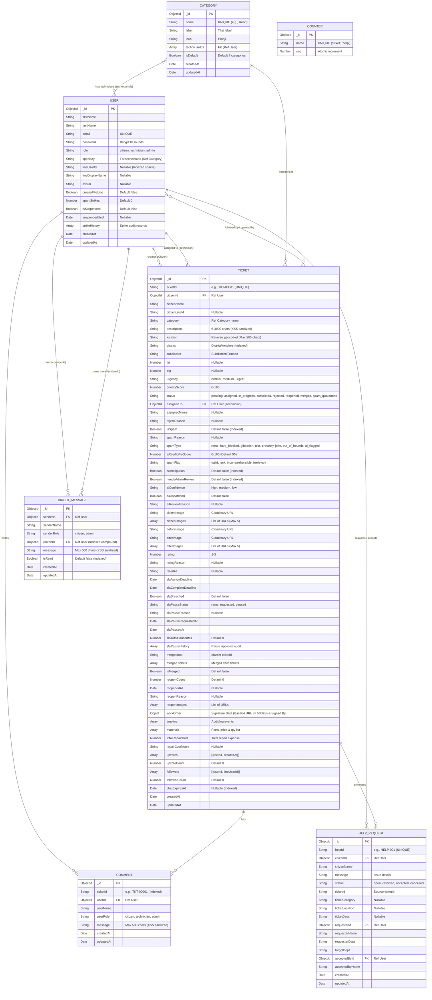

# Entity-Relationship (ER) Diagram - ResolvNow
> อัปเดตล่าสุด: 2026-09-30 | Version: V19.2

เอกสารนี้แสดงโครงสร้างและความสัมพันธ์ของฐานข้อมูล (MongoDB) ภายในระบบ ResolvNow ครอบคลุมทั้ง 7 Collections พร้อมฟิลด์ข้อมูลและการสกัดข้อมูลเชิงพื้นที่ (District Analytics), สถาปัตยกรรม Anti-Spam & Strike Engine และ AI Dispatcher

```mermaid
erDiagram
    USER ||--o{ TICKET : "creates (Citizen)"
    USER ||--o{ TICKET : "assigned to (Technician)"
    USER ||--o{ COMMENT : "writes"
    USER ||--o{ HELP_REQUEST : "requests / accepts"
    USER ||--o{ DIRECT_MESSAGE : "sends (senderId)"
    USER ||--o{ DIRECT_MESSAGE : "owns thread (citizenId)"
    CATEGORY ||--o{ TICKET : "categorizes"
    CATEGORY }|--o{ USER : "has technicians (technicianIds)"
    TICKET ||--o{ COMMENT : "has"
    TICKET ||--o{ HELP_REQUEST : "generates"
    TICKET }o--o{ USER : "followed by / upvoted by"

    USER {
        ObjectId _id PK
        String firstName
        String lastName
        String email "UNIQUE"
        String password "Bcrypt 10 rounds"
        String role "citizen, technician, admin"
        String specialty "For technicians (Ref Category)"
        String lineUserId "Nullable (Indexed sparse)"
        String lineDisplayName "Nullable"
        String avatar "Nullable"
        Boolean createdViaLine "Default false"
        Number spamStrikes "Default 0"
        Boolean isSuspended "Default false"
        Date suspendedUntil "Nullable"
        Array strikeHistory "Strike audit records"
        Date createdAt
        Date updatedAt
    }

    TICKET {
        ObjectId _id PK
        String ticketId "e.g., TKT-00001 (UNIQUE)"
        ObjectId citizenId FK "Ref User"
        String citizenName
        String citizenLineId "Nullable"
        String category "Ref Category name"
        String description "5-3000 chars (XSS sanitized)"
        String location "Reverse geocoded (Max 500 chars)"
        String district "District/Amphoe (Indexed)"
        String subdistrict "Subdistrict/Tambon"
        Number lat "Nullable"
        Number lng "Nullable"
        String urgency "normal, medium, urgent"
        Number priorityScore "0-100"
        String status "pending, assigned, in_progress, completed, rejected, reopened, merged, spam_quarantine"
        ObjectId assignedTo FK "Ref User (Technician)"
        String assignedName "Nullable"
        String rejectReason "Nullable"
        Boolean isSpam "Default false (Indexed)"
        String spamReason "Nullable"
        String spamType "none, hard_blocked, gibberish, test, profanity, joke, out_of_bounds, ai_flagged"
        Number aiCredibilityScore "0-100 (Default 95)"
        String spamFlag "valid, junk, incomprehensible, irrelevant"
        Boolean isAmbiguous "Default false (Indexed)"
        Boolean needsAdminReview "Default false (Indexed)"
        String aiConfidence "high, medium, low"
        Boolean aiDispatched "Default false"
        String aiReviewReason "Nullable"
        String citizenImage "Cloudinary URL"
        Array citizenImages "List of URLs (Max 5)"
        String beforeImage "Cloudinary URL"
        String afterImage "Cloudinary URL"
        Array afterImages "List of URLs (Max 5)"
        Number rating "1-5"
        String ratingReason "Nullable"
        String ratedAt "Nullable"
        Date slaAssignDeadline
        Date slaCompleteDeadline
        Boolean slaBreached "Default false"
        String slaPauseStatus "none, requested, paused"
        String slaPauseReason "Nullable"
        Date slaPauseRequestedAt
        Date slaPausedAt
        Number slaTotalPausedMs "Default 0"
        Array slaPauseHistory "Pause approval audit"
        String mergedInto "Master ticketId"
        Array mergedTickets "Merged child tickets"
        Boolean isMerged "Default false"
        Number reopenCount "Default 0"
        Date reopenedAt "Nullable"
        String reopenReason "Nullable"
        Array reopenImages "List of URLs"
        Object workOrder "Signature Data (Base64 URL <= 500KB) & Signed By"
        Array timeline "Audit log events"
        Array materials "Parts, price & qty list"
        Number totalRepairCost "Total repair expense"
        String repairCostNotes "Nullable"
        Array upvotes "[{userId, createdAt}]"
        Number upvoteCount "Default 0"
        Array followers "[{userId, lineUserId}]"
        Number followerCount "Default 0"
        Date chatExpiresAt "Nullable (Indexed)"
        Date createdAt
        Date updatedAt
    }

    CATEGORY {
        ObjectId _id PK
        String name "UNIQUE (e.g., Road)"
        String label "Thai label"
        String icon "Emoji"
        Array technicianIds "FK (Ref User)"
        Boolean isDefault "Default 7 categories"
        Date createdAt
        Date updatedAt
    }

    COMMENT {
        ObjectId _id PK
        String ticketId "e.g., TKT-00001 (Indexed)"
        ObjectId userId FK "Ref User"
        String userName
        String userRole "citizen, technician, admin"
        String message "Max 500 chars (XSS sanitized)"
        Date createdAt
        Date updatedAt
    }

    DIRECT_MESSAGE {
        ObjectId _id PK
        ObjectId senderId FK "Ref User"
        String senderName
        String senderRole "citizen, admin"
        ObjectId citizenId FK "Ref User (Indexed compound)"
        String message "Max 500 chars (XSS sanitized)"
        Boolean isRead "Default false (Indexed)"
        Date createdAt
        Date updatedAt
    }

    HELP_REQUEST {
        ObjectId _id PK
        String helpId "e.g., HELP-001 (UNIQUE)"
        ObjectId citizenId FK "Ref User"
        String citizenName
        String message "Issue details"
        String status "open, resolved, accepted, cancelled"
        String ticketId "Source ticketId"
        String ticketCategory "Nullable"
        String ticketLocation "Nullable"
        String ticketDesc "Nullable"
        ObjectId requesterId FK "Ref User"
        String requesterName
        String requesterDept
        String targetDept
        ObjectId acceptedById FK "Ref User"
        String acceptedByName
        Date createdAt
        Date updatedAt
    }

    COUNTER {
        ObjectId _id PK
        String name "UNIQUE ('ticket', 'help')"
        Number seq "Atomic increment"
    }
```
